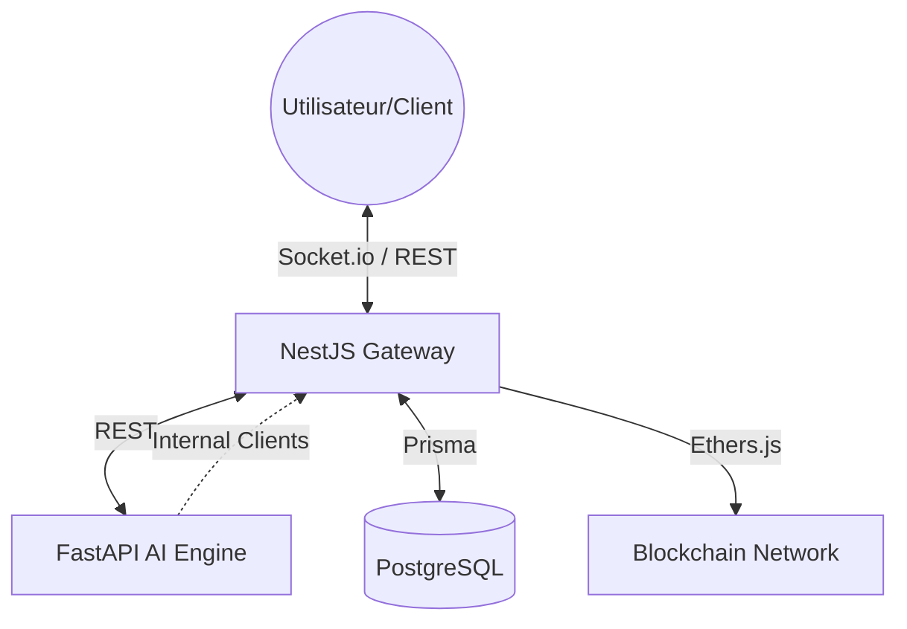

# 🚢 Smart Port Logistics : Documentation Technique Maîtresse

Ce document constitue la référence absolue pour l'architecture, l'implémentation et l'intégration du système Smart Port Logistics.

---

## 1. 🏗 Architecture Globale

Le système repose sur une architecture hybride **Micro-Services** et **IA-Centric**, conçue pour la scalabilité et la confiance.

### Schéma de Flux
Le backend est divisé en deux moteurs principaux communiquant via REST/JSON :

*   **NestJS (Core Engine - Port 3000)** : Responsable de la gestion des données immuables (PostgreSQL), de l'authentification (JWT), de la notarisation (Blockchain) et des notifications temps réel (WebSockets).
*   **FastAPI (AI Engine - Port 8000)** : Cerveau du système. Il orchestre les intentions des utilisateurs, génère des prévisions de trafic et propose des optimisations de créneaux.



### Swagger API Documentation
L'API est entièrement documentée avec Swagger :
- **URL** : `http://localhost:3000/docs`
- **Utilisation** : Permet de tester les endpoints en direct et de voir les schémas DTO.

### Infrastructure Docker
Le déploiement est entièrement conteneurisé pour garantir la reproductibilité.

| Service | Image | Rôle | Volume |
| :--- | :--- | :--- | :--- |
| `postgres` | `postgres:15-alpine` | Stockage persistant des données métier et logs. | `postgres:/var/lib/postgresql/data` |
| `backend` | `Dockerfile` (NestJS) | Gestion CRUD, Sécurité, Blockchain, WS. | - |
| `ai-service`| `Dockerfile` (FastAPI) | Orchestrator IA, Analytics, Simulation. | - |

---

## 2. 📊 Modèle de Données (Prisma)

Le schéma Prisma définit une hiérarchie stricte assurant l'intégrité des opérations portuaires.

### Entités Principales

| Entité | Description | Champs Clés | Relations |
| :--- | :--- | :--- | :--- |
| **User** | Entité d'authentification et profil. | `nin` (18 chiffres), `role`, `email`. | `1:N` avec `Booking`, `Conversation`. |
| **Carrier** | Société de transport (flotte). | `code` (unique), `contactEmail`. | `1:N` avec `Truck`, `User`. |
| **Truck** | Véhicules de transport. | `licensePlate` (ID unique), `type`. | `1:N` avec `Booking`. |
| **Terminal** | Zone logistique majeure. | `name`, `portId`. | `1:N` avec `Gate`. |
| **Gate** | Point d'entrée/sortie physique. | `name`, `type` (IN/OUT/GENERIC). | `1:N` avec `TimeSlot`, `Booking`. |
| **TimeSlot** | Créneau horaire de réservation. | `startTime`, `maxCapacity`, `currentBookings`.| `1:N` avec `Booking`. |
| **Booking** | Réservation de passage (Cœur métier).| `id` (UUID), `status`, `qrCode`. | Lien entre `User`, `Gate`, `Truck`, `Slot`. |
| **AuditLog** | Registre immuable des actions. | `action`, `entityId`, `details`. | `N:1` avec `User`. |
| **Conversation**| Historique Chat IA. | `userId`, `userRole`. | `1:N` avec `Message`. |

### Rôles (Enums)
*   `ADMIN` : Gestion infrastructure (Terminals, Gates).
*   `TERMINAL_OPERATOR` : Gestion opérationnelle (Confirm/Reject Bookings).
*   `CARRIER` : Gestion de flotte (Trucks) et réservations.
*   `DRIVER` : Consultation et validation QR Code.

---

## 3. 📚 Catalogue des API (Endpoints)

### 🔐 Authentification & Profil
*Base URL: `/api/auth`*

| Méthode | URL | Rôles | Entrée (JSON) | Sortie (JSON) | Logique |
| :--- | :--- | :--- | :--- | :--- | :--- |
| `POST` | `/signup` | Tous | `{ name, email, password, role, nin, ... }` | `{ access_token }` | Crée l'utilisateur et génère un JWT enrichi. |
| `POST` | `/login` | Tous | `{ email, password }` | `{ access_token }` | Authentification classique. |
| `GET` | `/profile` | Tous | - | `{ id, name, role, ... }` | Renvoie les infos du profil via le JWT. |

### 🚚 Gestion de Flotte (Trucks)
*Base URL: `/api/trucks`*

| Méthode | URL | Rôles | Entrée (JSON) | Logique |
| :--- | :--- | :--- | :--- | :--- |
| `POST` | `/` | `CARRIER` | `{ licensePlate, type }` | Crée un camion lié au `carrierId` du token. |
| `GET` | `/` | `CARRIER` | - | Liste les camions appartenant à la compagnie. |
| `DELETE` | `/:id` | `CARRIER` | - | Supprime un camion (vérification de propriété). |

### 📅 Réservations (Bookings)
*Base URL: `/api/bookings`*

| Méthode | URL | Rôles | Entrée (JSON) | Logique |
| :--- | :--- | :--- | :--- | :--- |
| `POST` | `/` | `CARRIER` | `{ gateId, truckId, timeSlotId }` | Vérifie la capacité du slot et émet `BOOKING_REQUESTED`. |
| `PUT` | `/:id/status` | `TDR Role`| `{ action: "CONFIRM" }` | Valide la résa (si Opérateur), génère le QR, écrit sur Blockchain. |
| `GET` | `/` | Tous | - | Filtre auto selon le rôle (Carrier voit les siens, Operator voit tout). |

---

## 4. 🤖 Intelligence Artificielle (Multi-Agent)

L'IA est intégrée via le module `AiModule` de NestJS qui agit comme un pont sécurisé.

### Flux de Communication
1.  **Requête** : Le Client appelle `POST /api/ai/chat`.
2.  **Proxy** : NestJS transmet la requête à FastAPI (`/api/chat`) en incluant le contexte utilisateur (`sub`, `role`) et l'entête d'autorisation.
3.  **Orchestration** : FastAPI utilise ses "Tools" (clients NestJS) pour lire l'historique ou vérifier les disponibilités.
4.  **Réponse** : FastAPI renvoie une réponse structurée (Texte + Data) que NestJS retourne au client.

### Capacités de l'IA
*   **Consultation en Temps Réel** : L'agent peut dire à un chauffeur si son booking est confirmé.
*   **Optimisation de Planning** : Suggère les créneaux les moins encombrés basés sur le `traffic/forecast`.
*   **Persistence** : Tous les échanges sont sauvegardés par FastAPI via NestJS dans les tables `Conversation` et `Message`.

---

## 5. 🛡️ Système de Confiance (Blockchain & Audit)

### Notarisation Blockchain
Utilise la librairie `ethers.js` pour enregistrer des preuves d'existence immuables. 
**Processus :**
1.  **Génération du Hash** : Un objet JSON contenant (`id`, `truckPlate`, `gate`, `timestamp`) est stringifié et haché par SHA-256.
2.  **Transaction** : Le hash est stocké sur la blockchain.
3.  **Audit** : Une fois la transaction confirmée, le `blockchainService` enregistre un succès dans les logs d'audit.

### Événements Audités
*   `CREATE_BOOKING`, `CONFIRM_BOOKING`, `CANCEL_BOOKING`.
*   `GATE_PASSAGE` (Validation d'entrée physique).
*   `BLOCKCHAIN_NOTARIZATION` (Tentative et Résultat).

---

## 6. 📡 Temps Réel & Notifications (WebSockets)

Le serveur NestJS utilise Socket.io pour la diffusion d'alertes instantanées.

| Événement | Destinataire | Payload | Déclencheur |
| :--- | :--- | :--- | :--- |
| `BOOKING_REQUESTED` | `role_OPERATOR` | `{ bookingId, slotTime }` | Nouvelle demande Carrier. |
| `BOOKING_STATUS_CHANGED`| `user_ID` | `{ bookingId, newStatus }` | Acceptation/Rejet par l'Opérateur. |
| `SLOT_FREED` | `Global/Admin` | `{ slotId }` | Annulation ou Rejet d'un booking. |
| `CAPACITY_FULL` | `role_OPERATOR` | `{ gateId, percentage }` | Utilisation du créneau > 90%. |
| `GATE_PASSAGE` | `role_OPERATOR` | `{ truckPlate, status }` | Validation physique à la barrière. |

---

## 7. 🚀 Déploiement & Tests

### Lancement via Docker
```bash
# Lancement complet (Postgres, NestJS, FastAPI)
docker compose up --build -d

# Initialisation de la base de données
npx prisma db push
```

### Script de Vérification
Un script automatisé est disponible pour valider l'intégrité du système de A à Z :
```bash
npx ts-node scripts/verify-flow.ts
```
**Il teste successivement :** Création compagnie -> Inscription utilisateur -> Création Camion -> Recherche Slot -> Réservation -> Annulation -> Chat IA.
