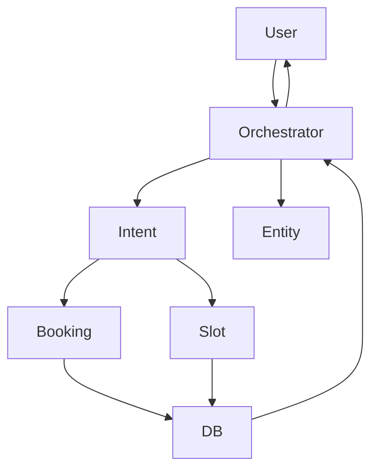

# 🚀 APCS-Booking  
**AI-Powered Multi-Agent Booking System**

> APCS-Booking est une plateforme intelligente de réservation développée dans le cadre d’un **hackathon**, combinant une **architecture backend moderne** et un **système d’intelligence artificielle multi-agents** pour automatiser la compréhension des demandes utilisateurs et la gestion des réservations.

---

## 🧠 Table des matières

1. Présentation  
2. Objectifs du projet  
3. Architecture globale  
4. AI System – Architecture Multi-Agents  
5. Fonctionnalités  
6. Technologies utilisées  
7. Schémas  
8. Installation & Lancement  
9. API – Endpoints principaux  
10. DevOps & Déploiement  
11. Limites & améliorations futures  
12. Contributeurs  
13. Licence  

---

## 📘 Présentation

APCS-Booking est un système de réservation intelligent permettant aux utilisateurs d’interagir en **langage naturel** pour :
- créer une réservation,
- vérifier la disponibilité de créneaux,
- modifier ou annuler une réservation,
- recevoir des propositions alternatives automatiquement.

Le cœur du projet repose sur un **système IA multi-agents orchestré**, capable de comprendre l’intention utilisateur et de déléguer les tâches aux agents spécialisés.

---

## 🎯 Objectifs du projet

- Automatiser la gestion des réservations  
- Exploiter une IA conversationnelle multi-agents  
- Séparer clairement logique métier, orchestration et IA  
- Proposer une architecture scalable et modulaire  
- Être fonctionnel dans un contexte hackathon  

---

## 🏗️ Architecture globale

```
Frontend (Client Web)
        |
        v
Backend API (Booking Service)
        |
        v
AI Multi-Agent System
        |
        v
Database
```

---

## 🤖 AI System – Architecture Multi-Agents

Le système IA est basé sur un **Orchestrator Agent** central coordonnant plusieurs agents spécialisés.

### Agents :
- Orchestrator Agent  
- Intent Classification Agent  
- Entity Extraction Agent  
- Booking Agent  
- Availability (Slot) Agent  
- Context & Memory Agent  

---

## 📊 Schéma du workflow IA



---

## ⚙️ Fonctionnalités

### Core
- Création, modification et annulation de réservations  
- Gestion des créneaux horaires  
- API REST documentée  

### IA
- Interaction en langage naturel  
- Orchestration multi-agents  
- Extraction automatique des entités  
- Suggestions intelligentes  

---

## 🛠️ Technologies utilisées

### Backend
- Python  
- FastAPI / Flask  
- REST API  

### AI System
- Large Language Models (LLM)  
- Architecture Multi-Agents  
- Prompt Engineering  
- Intent Classification  
- Entity Extraction  

### DevOps
- Docker  
- Docker Compose  

---

## 🚀 Installation & Lancement

```bash
git clone https://github.com/0xHouss/apcs-booking.git
cd apcs-booking
docker compose up -d
```

Backend : http://localhost:3000
Docs API : http://localhost:8000/docs  

---

## 📡 API – Endpoints principaux

| Méthode | Endpoint | Description |
|-------|---------|------------|
| GET | /bookings | Liste des réservations |
| POST | /bookings | Créer une réservation |
| PUT | /bookings/{id} | Modifier |
| DELETE | /bookings/{id} | Annuler |
| POST | /ai/chat | Chat IA multi-agents |

---

## 🚧 Limites & améliorations futures

- Mémoire IA persistante  
- Prédiction de charge  
- Monitoring des agents  
- Frontend conversationnel avancé  

---

## 👥 Contributeurs

Projet développé dans le cadre d’un **hackathon** par l’équipe APCS.

---
