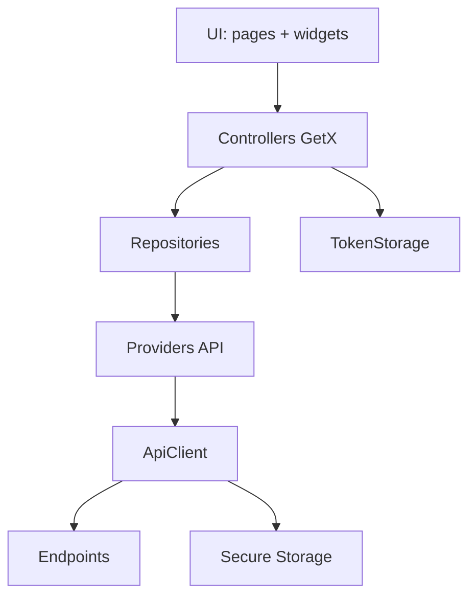
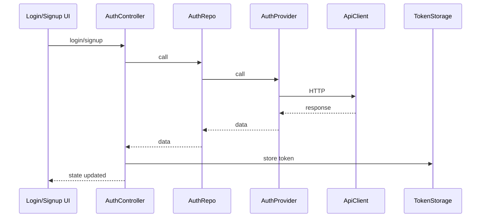
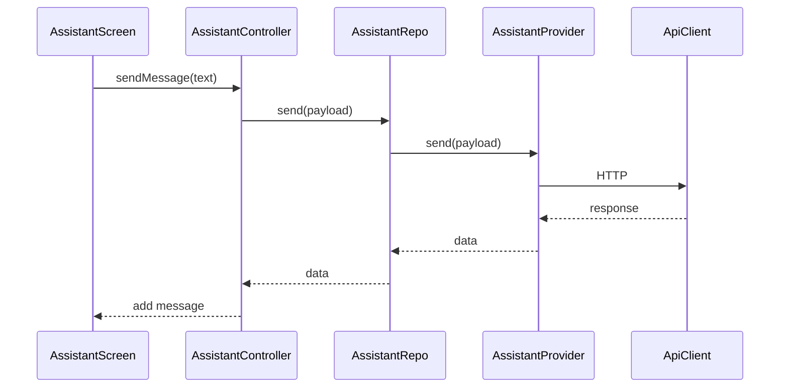
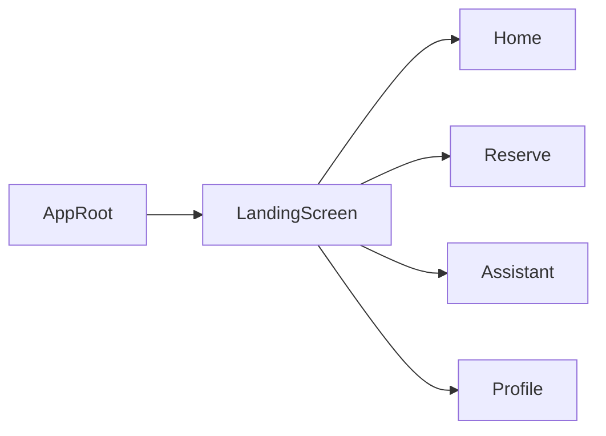

# mch

Rapport technique et architectural du projet Flutter "mch".

## Vue d'ensemble

Application mobile Flutter basee sur GetX pour l'injection de dependances et la gestion d'etat. L'app integre une authentification, un assistant conversationnel, des parcours de reservation, un profil utilisateur et un scanner QR pour les agents.

## Architecture (couches)

Le projet suit un decoupage en couches avec un flux de donnees classique:

1. UI (pages, widgets)
2. Controllers (GetX)
3. Repositories
4. Providers (API)
5. API Client + Storage (tokens)



## Flux fonctionnels cles

### Authentification



### Assistant (chat)



### Navigation principale



## Modules principaux

- `lib/main.dart`
- `lib/controllers/*`
- `lib/data/api/*`
- `lib/data/providers/*`
- `lib/data/repositories/*`
- `lib/pages/*`
- `lib/theme/*` et `lib/utils/themes.dart`

## Gestion d'etat et DI

- GetX pour:
  - Injection (`Get.put`, `Get.find`)
  - Observables (`Rx`, `Rxn`)
  - Navigation (`Get.off`, `Get.offAll`)

## Dependances (pubspec.yaml)

Principales dependances:

- `get`
- `flutter_screenutil`
- `dio`
- `flutter_secure_storage`
- `flutter_dotenv`
- `mobile_scanner`
- `flutter_map`
- `fl_chart`
- `model_viewer_plus`
- `flutter_svg`
- `oktoast`
- `web_socket_channel`
- `google_fonts`

## Configuration et assets

- `.env` charge via `flutter_dotenv`
- assets declares:
  - `assets/images/`
  - `assets/audio/`
  - `assets/icons/`
- polices:
  - `Inter`
  - `Gotham`

## Permissions plateforme

Scanner QR:

- Android: `android.permission.CAMERA` dans `android/app/src/main/AndroidManifest.xml`
- iOS: `NSCameraUsageDescription` dans `ios/Runner/Info.plist`

## Points d'architecture a surveiller

- Multiples themes et styles (risque d'incoherence visuelle).
- Dependances non utilisees possibles (ex: `flutter_bloc`, `get_it`).
- Double chargement d'historique evite dans l'assistant, a maintenir.

## Structure du projet (extrait)

```text
lib/
  controllers/
  data/
    api/
    providers/
    repositories/
    services/
  pages/
    assistant/
    Auth/
    booking/
    home/
    landingScreen/
    option/
    profile/
  theme/
  utils/
```

## Notes d'execution

Ce rapport est base sur une analyse statique du code. Aucun build ou test automatique n'a ete lance.
