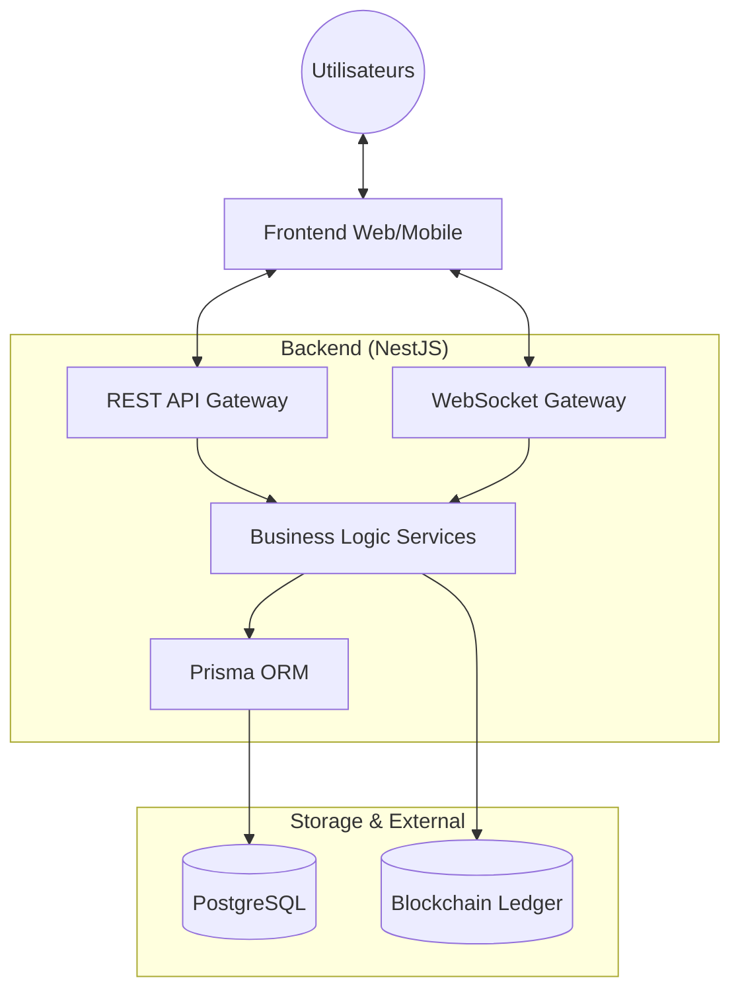
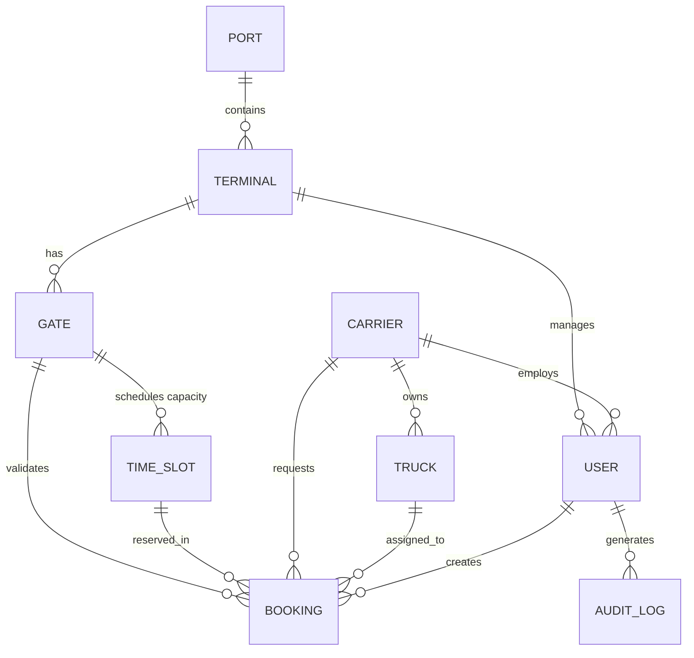

# 🛠️ Smart Port Logistics Hub - Technical Documentation

This document provides a deep dive into the technical architecture, data models, and system components of the Smart Port Logistics platform.

---

## 🏗️ System Architecture

The backend is built as a **Modular Monolith** using **NestJS**, ensuring a clean separation of business domains while maintaining simplicity in deployment.

### High-Level Architecture


---

## 📊 Data Model (Database Schema)

We use **Prisma** with **PostgreSQL**. The schema is designed to reflect the physical hierarchy of a port and the lifecycle of a logistics booking.

### Entity Relationship Diagram


### Key Models
- **Booking**: The core entity representing a truck's scheduled passage.
- **TimeSlot**: Defines capacity windows (e.g., 2 hours) with a `maxCapacity` to prevent congestion.
- **AuditLog**: Implements full traceability for security compliance.

---

## 🔐 Security & Gateway

### API Gateway
All incoming requests pass through the NestJS Gateway which handles:
- **Authentication**: JWT-based (Bearer Token).
- **Authorization**: Role-Based Access Control (RBAC) via `@Roles` decorator.
    - `CARRIER`: Create and view own bookings.
    - `OPERATOR`: Confirm bookings and validate gate entries.
    - `ADMIN`: Full system access and audit logs.
- **Rate Limiting**: Throttling enabled to prevent abuse (10 req/min).

### WebSocket Gateway (Real-Time)
Uses **Socket.io** to push updates without client polling.
- **Rooms**: Automatic joining of `user_<id>` and `role_<role>` rooms.
- **Events**: `BOOKING_CREATED`, `CAPACITY_ALERT` (at 90% load), `GATE_PASSAGE`.

---

## ⛓️ Blockchain Notary Integration

To ensure **non-repudiation** and **immuability**, we integrated a blockchain layer.

### Implementation Details
- **Logic**: For every confirmed booking and gate passage, a SHA-256 hash of the transaction data is generated.
- **On-Chain**: The hash is stored on a smart contract, providing a permanent digital fingerprint.
- **Resilience**: Operates in "Fire and Forget" mode. If the blockchain network is down, the system continues in "Degraded Mode" while logging the event in the audit trail.

---

## 🚧 Smart Gate Integration (IoT)

The system includes a production-ready logic for IoT-enabled gates.

### Validation Flow
1. **Request**: Scanner sends `bookingRef` or `qrCode` to `/gates/:id/validate-entry`.
2. **Logic**: Verified for `CONFIRMED` status, correct gate location, and valid time window.
3. **Action**: Booking updated to `CONSUMED`, real-time alert sent to operators, and action notarized.

---

## 📂 Project Structure

```bash
src/
├── guards/           # Auth, Roles, and Throttling logic
├── interceptors/      # Response transformation & Pagination
├── modules/
│   ├── ai/           # AI-agent optimized endpoints
│   ├── audit/        # System-wide traceability
│   ├── blockchain/   # Web3 integration layer
│   ├── bookings/     # Booking engine logic
│   ├── gate/         # Infrastructure & Capacity management
│   ├── websocket/    # Real-time event broadcasting
│   └── prisma/       # Persistence layer
└── app.module.ts     # Main application assembly
```

---
*Developed for MicroHack 3 - Elevating Port Logistics with Modern Engineering.*
