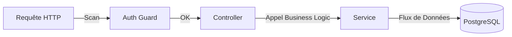

# 🚀 Documentation Technique : Backend Smart Port Hub

Ce document est conçu pour t'aider à expliquer tes choix techniques devant un jury ou des mentors. Il détaille la partie **NestJS Backend**, l'architecture et la stratégie de déploiement.

---

## 🛠️ 1. Stack Technique (Le "Pourquoi")

| Technologie | Role | Pourquoi ? |
| :--- | :--- | :--- |
| **NestJS** | Framework Node.js | Pour son architecture **modulaire** et **Scalable**. Il impose une structure rigoureuse (D.I., Modules) idéale pour le travail en équipe. |
| **TypeScript** | Langage | Typage statique pour réduire les bugs en production et améliorer l'autocomplétion (DX). |
| **Prisma ORM** | Gestion de la BDD | Pour son **Type-safety**. Prisma génère un client TypeScript basé sur le schéma, empêchant les erreurs de requêtes SQL. |
| **PostgreSQL** | Base de données | Fiabilité, robustesse et support natif des relations complexes et du JSON. |
| **JSON Web Token (JWT)** | Sécurité | Standard de l'industrie pour une authentification stateless et sécurisée. |
| **Socket.io** | Temps Réel | Pour notifier instantanément les opérateurs portuaires lors de la validation d'une entrée. |
| **Ethers.js** | Blockchain | Intégration légère pour notariser les hashs de passage sur un ledger immuable. |

---

## 🏗️ 2. Architecture Modulaire & En Couches

Le projet suit le pattern **Controller-Service-Repository**, ce qui permet de séparer proprement les responsabilités.

### Le Flux d'une Requête :
1.  **Controller (`.controller.ts`)** : C'est la porte d'entrée. Il définit les routes, valide les entrées (via `class-validator`) et gère les réponses HTTP.
2.  **Service (`.service.ts`)** : C'est le cerveau. Il contient toute la logique métier. Il ne sait rien du HTTP.
3.  **Prisma (Couche de données)** : Le service utilise le client Prisma pour interagir avec la base de données de manière typée.

---

## 📡 3. Aperçu des API & Modules

Voici les principaux modules qui composent le backend :

- **`Auth`** : Inscription et Connexion sécurisée avec JWT.
- **`Bookings`** : Création, consultation et annulation de réservations de créneaux.
- **`Gate`** : Moteur de validation des entrées. C'est ici qu'on vérifie si un camion est "au bon endroit, au bon moment".
- **`TimeSlot`** : Gestion intelligente de la capacité temporelle du port.
- **`Chat`** : Persistance des conversations avec stockage des historiques et métadonnées d'IA.
- **`AI`** : Moteur de recommandation de créneaux et pont vers le microservice IA externe.
- **`Blockchain`** : Service de notarisation pour sécuriser les preuves de passage.
- **`Audit`** : Enregistrement automatique de toutes les actions pour la traçabilité administrative (exposé via AuditLogController).

### A. Contrôle d'Accès (RBAC)
Nous avons implémenté un système de **Rôles** (`ADMIN`, `OPERATOR`, `CARRIER`). Un `Guard` global intercepte les requêtes et vérifie si l'utilisateur possède les permissions nécessaires avant même que le code du controller ne s'exécute.

### B. Notarisation Blockchain
Pour chaque passage confirmé :
1. On génère un hash unique des données du passage.
2. On l'envoie sur une blockchain via `BlockchainService`.
3. **But** : Créer une preuve infalsifiable du passage, utile pour les litiges ou l'audit.

### C. Gestion de la Congestion
Le module `TimeSlot` limite le nombre de camions par créneau (`maxCapacity`). Le Backend compare en temps réel les réservations actuelles avec la capacité pour bloquer les sur-réservations.

---

## 🐳 5. Dockerization & Automatisation

### Pourquoi Docker ?
*"Ça fonctionne sur ma machine"* n'est plus une excuse. Docker garantit que le projet tourne exactement de la même manière partout.

### Le flux `docker compose up --build` :
1. **Multi-Stage Build** : Le `Dockerfile` compile le code TypeScript en JavaScript pur dans une première étape, puis ne garde que le strict nécessaire pour la production (réduction de la taille de l'image).
2. **Postgres Healthcheck** : Le backend attend que la base de données soit réellement prête avant de tenter de se connecter.
3. **Auto-Migration & Seeding** : Au démarrage du container, Prisma synchronise le schéma et injecte les données de test automatiquement. Pas besoin de configurer la BDD à la main.

---

## 📝 6. Résumé pour les Mentors (Le Pitch)
*"Nous avons conçu un backend **robuste** et **typé** avec NestJS et Prisma. L'architecture est modulaire pour permettre une scalabilité horizontale. Nous avons intégré des technologies modernes comme les **WebSockets** pour le temps réel, la **Blockchain** pour la traçabilité, et un **Moteur IA** pour l'optimisation des flux. Enfin, tout le projet est **containerisé** avec Docker et dispose d'une **suite de vérification automatisée** pour un déploiement 'One-Click' fiable et reproductible."*
