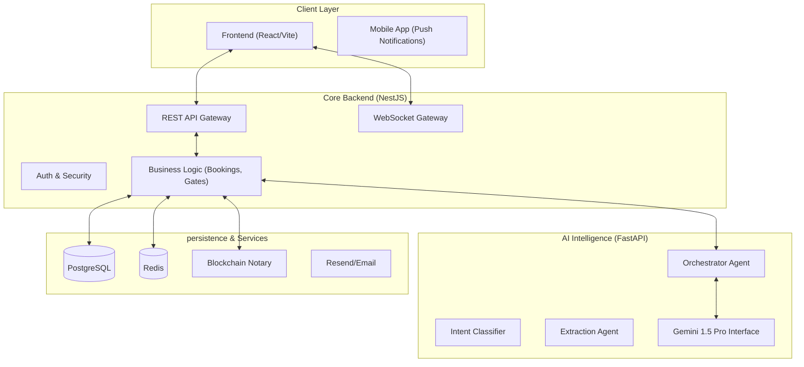

# 🚀 APCS-Booking: AI-Powered Multi-Agent Logistics Engine

[](https://nestjs.com/)
[](https://fastapi.tiangolo.com/)
[](https://www.postgresql.org/)
[](https://www.prisma.io/)
[](https://www.docker.com/)
[](https://ethers.org/)

**APCS-Booking** is a next-generation logistics management platform built during a high-stakes hackathon. It combines enterprise-grade backend architecture with a sophisticated **Multi-Agent AI orchestration** system and an **Immutable Blockchain Notary** to automate complex port booking workflows through natural language.

---

## 💎 Core Value Propositions

- **🤖 Autonomous Orchestration**: A multi-agent system that understands intents and negotiates bookings without human intervention.
- **🔗 Immutable Blockchain Notary**: Integration with Ethereum/EVM chains via **Ethers.js** to notarize every critical booking event, ensuring a tamper-proof audit trail.
- **🛡️ Enterprise Security**: Built-in Rate Limiting, JWT stateless Auth, and modular validation guards.
- **📡 Real-time IoT Sync**: WebSocket-driven gate control and instant status updates for drivers and operators.

---

## ⛓️ Blockchain Notary Implementation

The system leverages a dedicated **Blockchain Notary Module** to ensure the integrity of logistics data:

- **Technology**: Ethers.js + EVM-compatible Smart Contracts.
- **Workflow**: 
    1. A booking status changes to `CONFIRMED`.
    2. A background service hashes the booking metadata (Booking ID, Driver, Time).
    3. The hash is pushed to a smart contract via an automated transaction.
    4. The transaction receipt is stored in the system's audit logs, providing a permanent link to the on-chain proof.
- **Validation**: Developers can verify any booking against the blockchain using the `scripts/test_all.js` suite.

---

## 🏗️ Architecture Design



---

## 🤖 AI Multi-Agent Intelligence

The system isn't just a chatbot; it's a **coordinated strike team** of AI agents:

1.  **Orchestrator**: The "Brain" that decides which specialist agent to call.
2.  **Intent Classifier**: Determines if the user wants to book, cancel, or check availability.
3.  **Entity Extractor**: Pulls license plates, times, and cargo details from messy text.
4.  **Availability Agent**: Negotiates with the database to find optimal time slots.
5.  **Context Manager**: maintains "Memory" across the conversation for a human-like flow.

---

## 🚀 Quick Start (One-Click Deployment)

The entire ecosystem is containerized for instant startup.

```bash
# Clone the repository
git clone https://github.com/ademboukabes/Silence-team1.git

# Enter the root
cd Silence-team1

# Start all services (Backend, AI, DB, Redis)
docker compose up -d --build
```

- **Backend API**: `http://localhost:3000`
- **Interactive API Docs**: `http://localhost:3000/api`
- **AI Health Check**: `http://localhost:8000/docs`

---

## 🧪 Comprehensive Testing

We've consolidated our entire testing suite into a single, high-reliability command.

```bash
cd backend
node scripts/test_all.js
```

**The Test Suite validates:**
- [x] **Auth**: Multi-role login (Admin, Operator, Carrier).
- [x] **Lifecycle**: Booking creation $\rightarrow$ Operator Confirmation $\rightarrow$ Deployment.
- [x] **IoT**: IoT Gate validation logic & security barrier control.
- [x] **Blockchain**: Verification of the immutable notarization log.
- [x] **Security**: Active Rate Limiting provocation (DDOS protection).

---

## 📡 Essential API Endpoints

| Category | Method | Endpoint | Description |
| :--- | :--- | :--- | :--- |
| **Auth** | `POST` | `/api/auth/login` | Secure JWT Login |
| **Bookings** | `POST` | `/api/bookings` | Create automated booking |
| **Intelligence**| `POST` | `/api/ai/chat` | **Multi-Agent Natural Language Interactor** |
| **IoT Gate** | `POST` | `/api/gates/:id/validate`| IoT Validation Endpoint |
| **Analytics** | `GET` | `/api/analytics/metrics`| Business Intelligence Dashboard |

---

## 🛠️ Configuration & Environment

Configuration is centralized in `backend.env` for the API and `ai.env` for the intelligence layer.

```env
# Key configurations required:
RESEND_API_KEY=  # Email delivery
GOOGLE_API_KEY= # Gemini 1.5 Pro
BLOCKCHAIN_RPC= # Ethereum/EVM Endpoint
```

---

## 👥 Contributors & Vision

Developed by **Silence-Team1 / APCS** during a 48h Hackathon challenge to push the boundaries of automated logistics.

**License**: Proprietary - All rights reserved.

