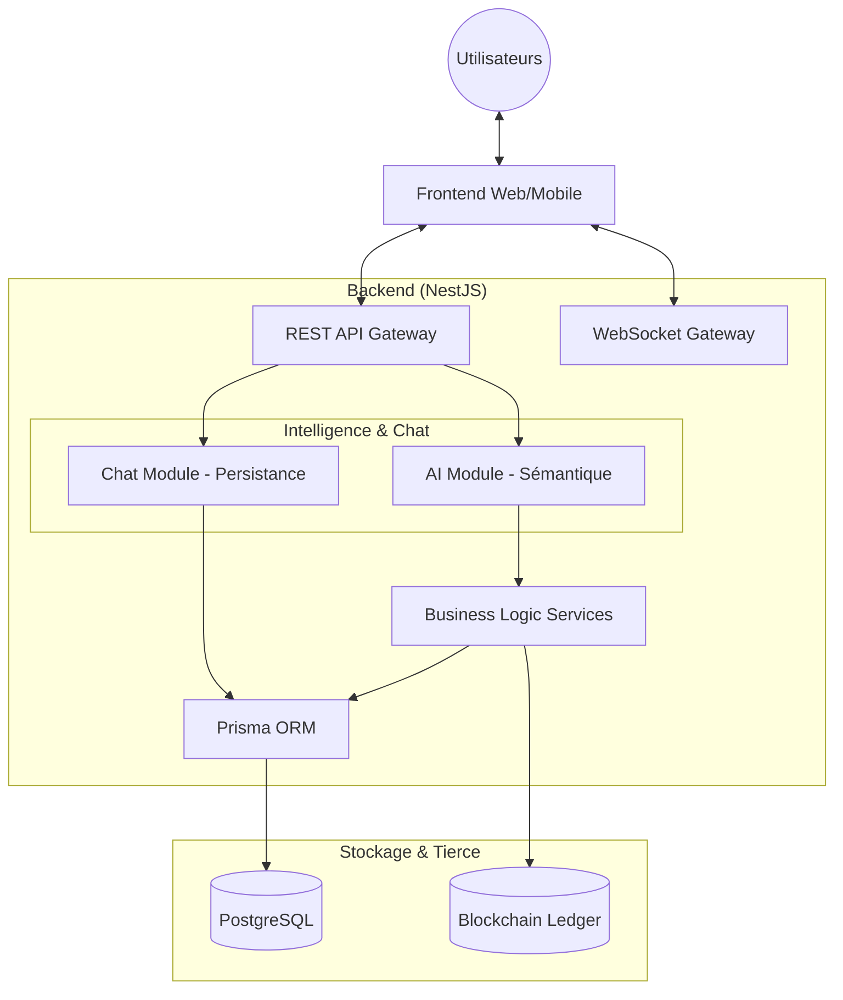
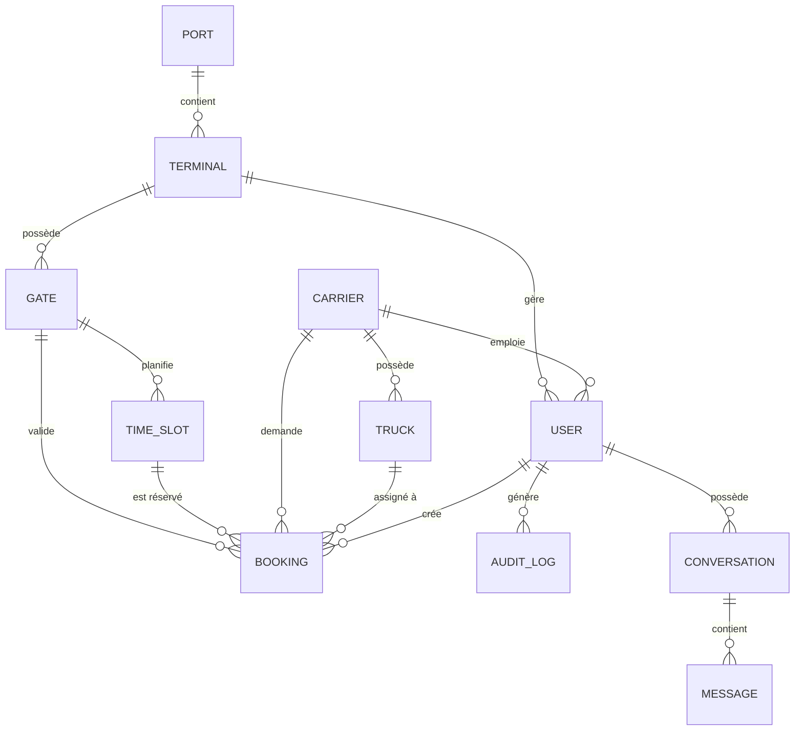

# 🛠️ Hub de Logistique Portuaire - Documentation Technique

Cette documentation détaille l'architecture, les modèles de données et les composants système de la plateforme Smart Port Logistics.

---

## 🏗️ Architecture du Système

Le système adopte une architecture **Monolithe Modulaire** construite avec **NestJS**. Cette approche permet de découpler les domaines métier tout en simplifiant le déploiement.

### Vue d'Ensemble


---

## 📊 Modèle de Données (Schema)

Nous utilisons **Prisma** avec **PostgreSQL**. Le schéma reflète la hiérarchie physique d'un port et le cycle de vie d'une réservation logistique.

### Diagramme de Relations (ERD)


### Modèles Clés
- **Booking** : L'entité centrale représentant le passage prévu d'un camion.
- **TimeSlot** : Définit des fenêtres de capacité (ex: 2h) avec un `maxCapacity` pour prévenir la congestion.
- **Conversation & Message** : Nouveau module de persistance pour l'historique des interactions, supportant les métadonnées d'intention (intent) pour l'IA.

---

## 🤖 Chatbot & Intelligence Artificielle (Backend)

Le backend est structuré pour supporter une expérience de chatbot "AI-First" à travers deux piliers :

### 1. Couche Sémantique (`AIModule`)
Contrairement aux terminaux classiques, ce module expose des données structurées optimisées pour la consommation par des LLM (Large Language Models) :
- **Availability Agent** : Fournit une vue simplifiée des créneaux libres sans fioritures techniques.
- **Reference Agent** : Permet de retrouver instantanément le statut d'une réservation via langage naturel (transcrit en appels d'API sémantiques).

### 2. Couche de Persistance (`ChatModule`)
Le chatbot ne se contente pas de répondre, il "se souvient" :
- **Lifecycle Management** : Les conversations sont persistantes et liées au profil utilisateur.
- **Metadata Context** : Chaque message peut stocker l'intention détectée (`intent`) et les métadonnées techniques du passage, permettant d'affiner les réponses futures.

---

## 🔐 Sécurité & Contrôle d'Accès

### Authentification & Autorisation
- **JWT** : Toutes les requêtes sont sécurisées par des jetons Bearer.
- **RBAC (Role-Based Access Control)** : 
    - `CARRIER` : Peut créer et voir uniquement ses propres réservations et chats.
    - `OPERATOR` : Peut valider les entrées et superviser les flux de son terminal.
    - `ADMIN` : Accès global au système, analytics et logs d'audit.

### Protection contre les abus
- **Throttling** : Limitation du nombre de requêtes à 10 par minute pour éviter les attaques par déni de service (DDoS) ou le scraping.

---

## ⛓️ Intégration Blockchain
Pour garantir la **non-répudiation**, nous avons intégré une couche Blockchain.
- **Logique** : Pour chaque passage confirmé à une porte, un hash SHA-256 des données est généré.
- **On-Chain** : Ce hash est stocké de manière permanente, créant une preuve infalsifiable du passage.

---

## 🚧 Smart Gate (IoT Ready)
Le système inclut une logique prête pour les portes connectées (IoT).
1. **Requête** : Le scanner envoie le `id` à `/gates/:id/validate-entry`.
2. **Validation** : Vérification du statut, de la localisation de la porte et de la fenêtre temporelle.
3. **Action** : Le statut passe à `CONSUMED`, une alerte WebSocket est envoyée aux opérateurs, et l'action est notarisée sur la blockchain.

---

## 📂 Structure du Projet

```bash
src/
├── guards/           # Logique Auth, Roles et Throttling
├── interceptors/      # Transformation des réponses & Pagination
├── modules/
│   ├── ai_service/   # Recommandations & Pont vers service IA externe
│   ├── audit/        # Traçabilité système (AuditLogController)
│   ├── blockchain/   # Couche d'intégration Web3
│   ├── bookings/     # Moteur de réservation
│   ├── chat/         # Persistance chat & RBAC
│   ├── gate/         # Gestion infrastructure & capacité
│   ├── websocket/    # Diffusion d'événements en temps-réel
│   └── prisma/       # Couche de persistance ORM
└── app.module.ts     # Pivot central de l'application
```

---

## 🐳 Environnement Docker

Le projet utilise Docker Compose pour orchestrer les services :
- **PostgreSQL (15-alpine)** : Base de données principale avec healthcheck.
- **Backend (Node 20)** : Application NestJS compilée et exécutée en mode production.

### Automatisation au démarrage :
1. **Prisma DB Push** : Synchronisation immédiate du schéma.
2. **Prisma Seed** : Initialisation des données métier critiques.
3. **Optimisation** : Suppression des dépendances de développement pour une image légère.

---
*Développé pour MicroHack 3 - Optimisation Logistique par l'Ingénierie Moderne.*

